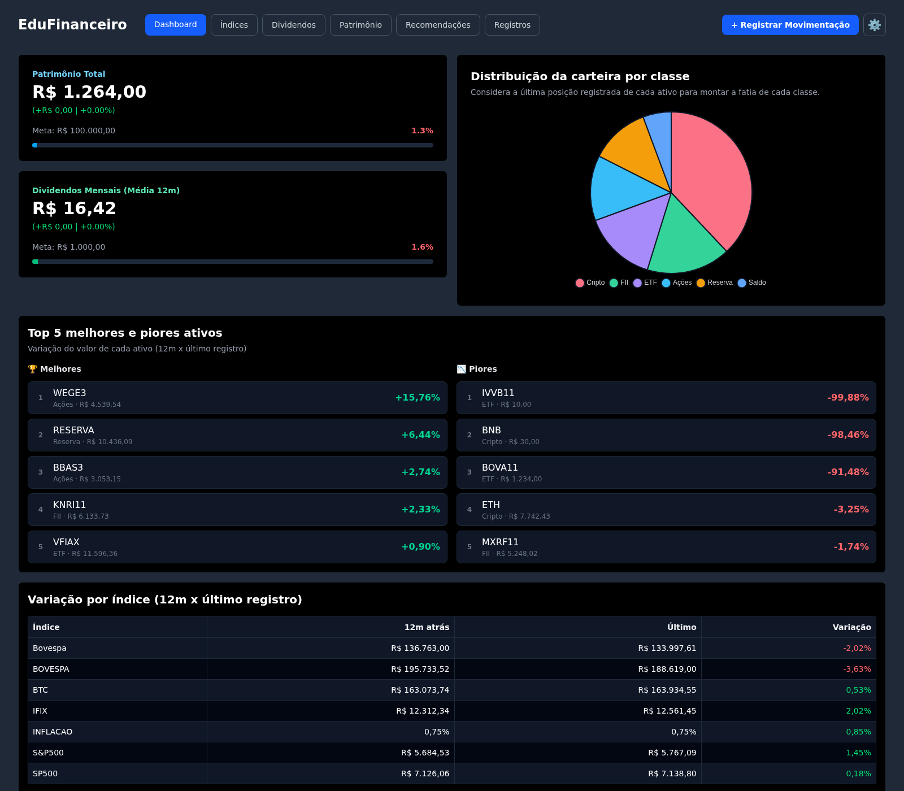
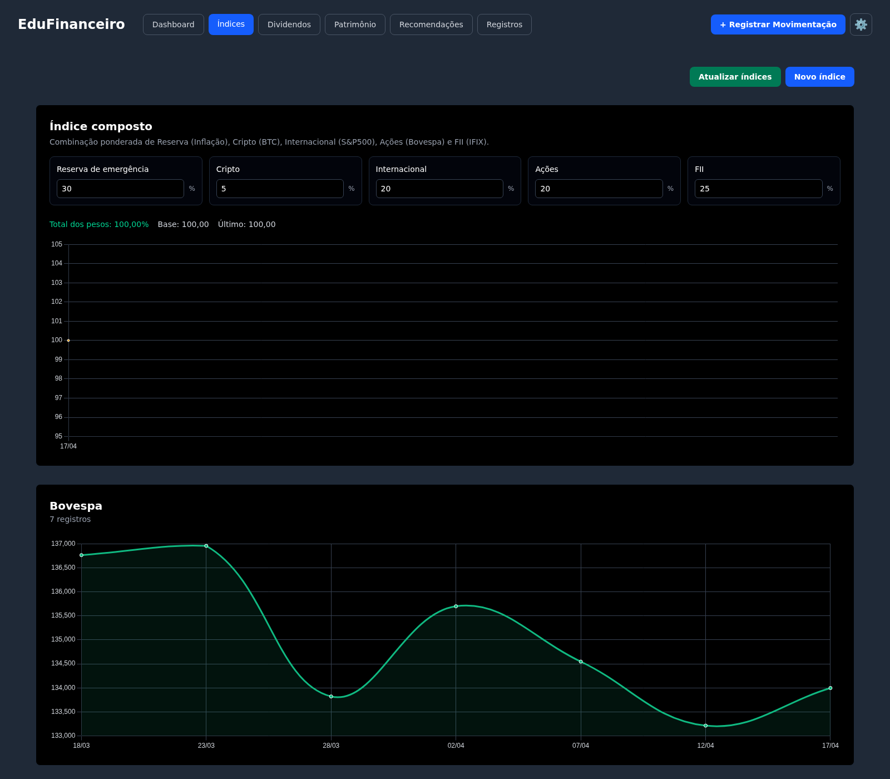
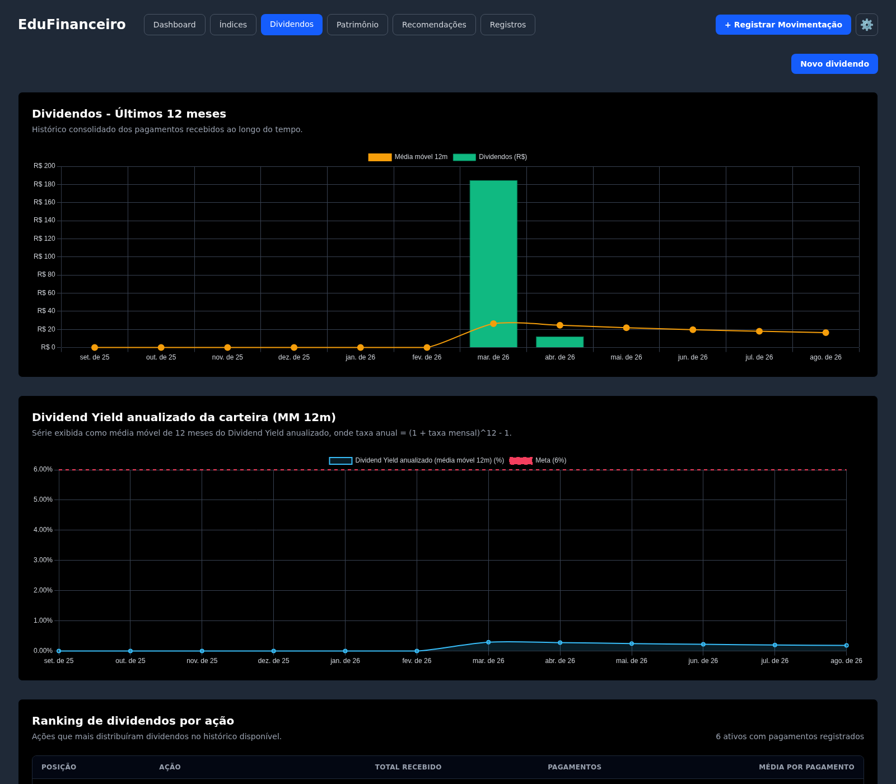
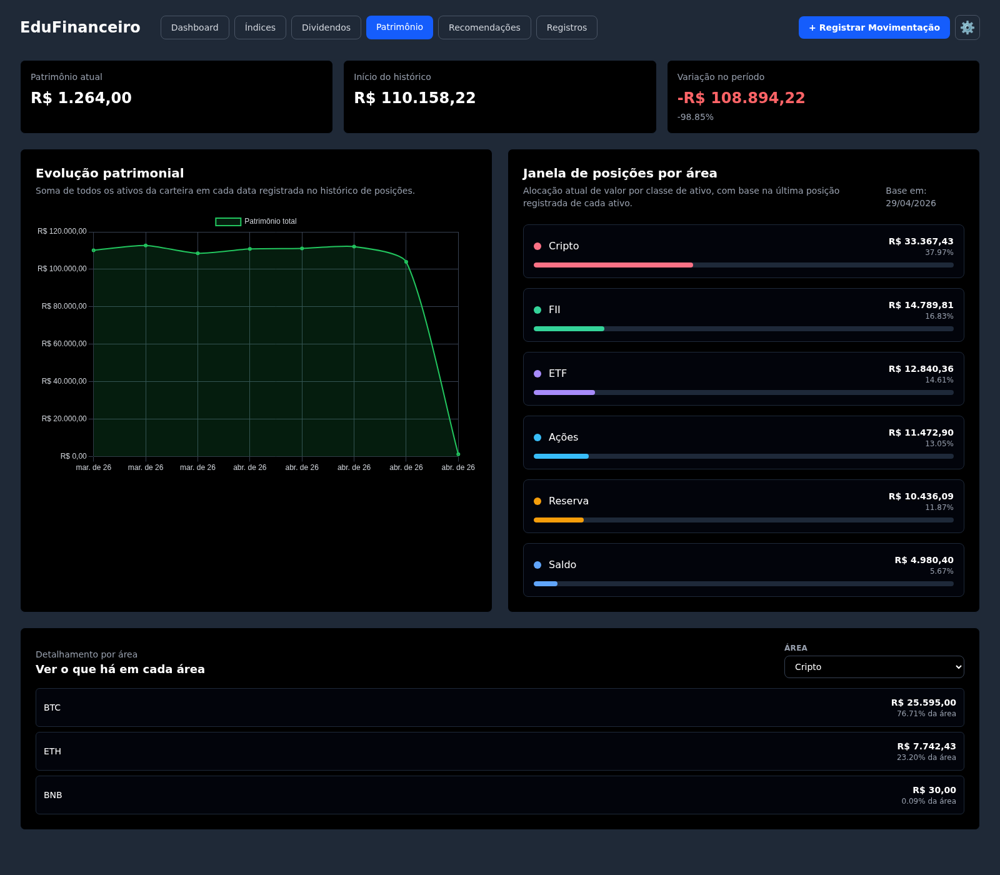
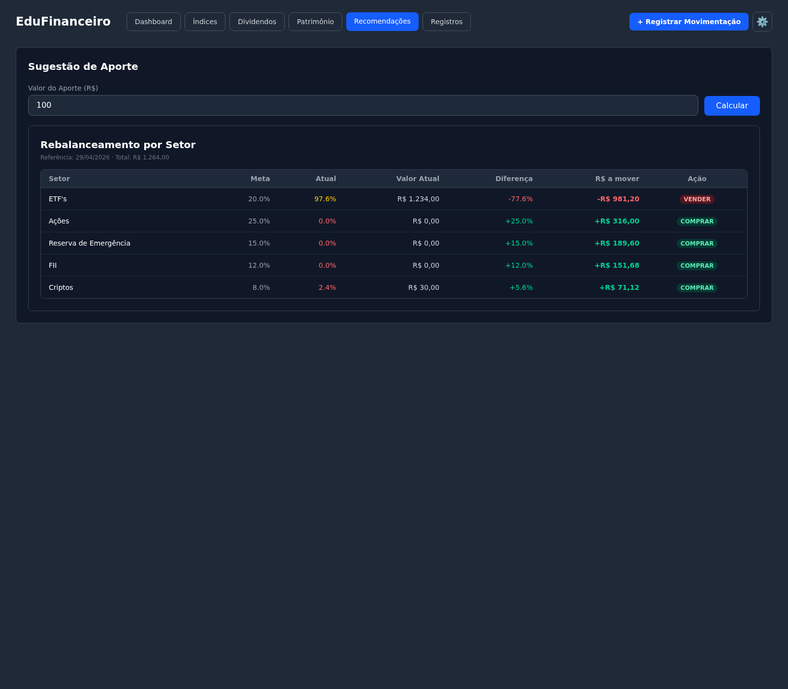
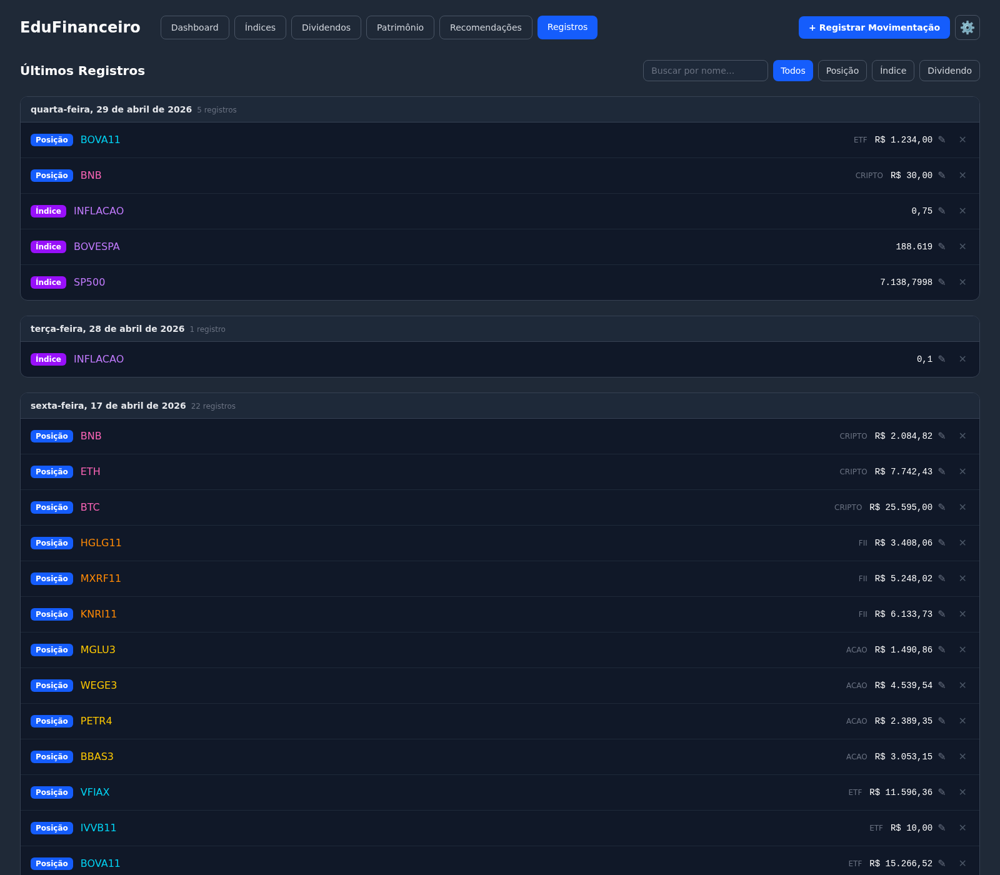

# EduFinanceiro

Aplicação web para controle pessoal de investimentos: registre posições em ações, FIIs, ETFs, criptos e reserva de emergência, acompanhe dividendos, evolução patrimonial e receba sugestões de aporte e rebalanceamento com base em dados de mercado.

Stack: **Django + Django REST Framework** (API) e **React + Vite + Tailwind CSS + Chart.js** (frontend).

## Funcionalidades

### 📊 Dashboard
Visão geral do patrimônio com valor total, progresso em relação a uma meta configurável, distribuição da carteira por classe de ativo (gráfico de pizza), top 5 melhores/piores ativos (variação 12 meses x último registro) e variação dos principais índices de mercado.



### 📈 Índices
Acompanhamento histórico de índices de mercado (Bovespa, IFIX, S&P 500, BTC, Inflação) com gráficos individuais, além de um **índice composto** configurável, em que é possível ajustar o peso de cada componente (Reserva, Cripto, Internacional, Ações, FII) para simular uma carteira de referência. Um botão "Atualizar índices" busca as cotações mais recentes via `yfinance` e a inflação via API do Banco Central.



### 💰 Dividendos
Histórico de dividendos recebidos nos últimos 12 meses, dividend yield anualizado da carteira (média móvel de 12 meses) comparado a uma meta, e ranking dos ativos que mais pagaram dividendos.



### 🧾 Patrimônio
Evolução do patrimônio total ao longo do tempo, alocação atual por classe de ativo com barras de progresso, e detalhamento de quais ativos compõem cada classe.



### 🤖 Recomendações
- **Sugestão de aporte**: dado um valor a investir, o backend analisa a lista de ações em `stocks.txt` via `yfinance` (preço, histórico de dividendos, yield médio, desvio padrão e potencial de valorização) e sugere quais comprar/evitar, com o valor a alocar em cada ativo.
- **Rebalanceamento por setor**: compara a alocação atual da carteira com metas percentuais por classe de ativo (configuráveis via admin ou usando padrões embutidos) e indica o que comprar/vender para se aproximar da meta.



### 📜 Registros
Lista unificada e pesquisável de todos os lançamentos (posições, índices e dividendos), agrupados por data, com edição inline de valores e exclusão.



### ➕ Registrar Movimentação
Modal acessível em qualquer página para registrar uma **Compra** (soma ao valor atual do ativo), **Venda** (subtrai) ou **Atualização** (define o valor absoluto), criando o ativo automaticamente se ele ainda não existir.

### ⚙️ Configurações
Metas de patrimônio total e de dividendos mensais, usadas nas barras de progresso do Dashboard (armazenadas no navegador).

## Arquitetura

```
investment-tracker/
├── invesmenttracker/          # Backend (Django)
│   ├── invesmenttracker/      # Configurações do projeto (settings, urls)
│   ├── investments/           # App principal
│   │   ├── models.py          # Ativo, Indice, Posicao, MetaPortfolio, Dividendo
│   │   ├── views.py           # API REST + endpoints de ações (registrar, atualizar índices, rebalanceamento...)
│   │   ├── serializers.py
│   │   ├── recomendador.py    # Algoritmo de recomendação de ações
│   │   └── admin.py
│   ├── manage.py
│   └── db.sqlite3
├── frontend/                  # Frontend (React + Vite)
│   └── src/
│       ├── DashboardPage.jsx, IndicesPage.jsx, DividendosPage.jsx,
│       │   EvolucaoPatrimonialPage.jsx, RecomendadoresPage.jsx, UltimosRegistrosPage.jsx
│       └── *Modal.jsx         # Modais de registro/edição
├── stocks.txt                 # Lista de tickers analisados pelo recomendador
├── iniciar.sh / iniciar.bat   # Scripts de setup + start (Linux/Windows)
└── stock_production.ipynb     # Notebook de apoio para experimentação
```

**Modelos principais:**
- `Ativo` — código/nome do ativo e sua classe (Reserva, ETF, FII, Cripto, Ações, Saldo)
- `Posicao` — valor em R$ de um ativo em uma data (snapshot)
- `Indice` — valor de um índice de mercado em uma data
- `Dividendo` — valor recebido de um ativo em uma data
- `MetaPortfolio` — meta percentual de alocação por classe de ativo

## Pré-requisitos

- Python 3.10+
- Node.js + npm
- Acesso à internet (para `yfinance` e a API do Banco Central, usadas nas recomendações e atualização de índices)

## Como rodar

### Opção 1 — script automatizado (Linux)

```bash
./iniciar.sh
```

O script detecta o gerenciador de pacotes do sistema, cria o ambiente virtual do backend, instala as dependências (Python e npm), aplica as migrations e sobe os dois servidores.

- Frontend: http://localhost:5173
- API: http://localhost:8000/api
- Admin: http://localhost:8000/admin

No Windows, use `iniciar.bat`.

### Opção 2 — manual

**Backend:**
```bash
cd invesmenttracker
python3 -m venv .venv
source .venv/bin/activate        # Windows: .venv\Scripts\activate
pip install django djangorestframework django-cors-headers pandas yfinance
python3 manage.py migrate
python3 manage.py runserver 0.0.0.0:8000
```

**Frontend** (em outro terminal):
```bash
cd frontend
npm install
npm run dev
```

Acesse `http://localhost:5173`.

## API

Todas as rotas abaixo ficam sob `http://localhost:8000/api/`.

| Método | Endpoint | Descrição |
|---|---|---|
| GET | `/ativos/` | Lista ativos cadastrados |
| GET/POST/PATCH/DELETE | `/indices/` | CRUD de índices |
| GET/POST/PATCH/DELETE | `/posicoes/` | CRUD de posições |
| GET/POST/PATCH/DELETE | `/dividendos/` | CRUD de dividendos |
| POST | `/registrar-posicao/` | Registra compra, venda ou atualização de posição |
| POST | `/atualizar-indices/` | Busca cotações atuais (yfinance) e inflação (BCB) |
| GET | `/rebalanceamento/` | Compara alocação atual x metas por classe |
| GET | `/sugestao-aporte/?valor=100` | Sugestão de alocação de um aporte |
| GET | `/ultimos-registros/` | Lista unificada de posições, índices e dividendos recentes |

Painel administrativo do Django em `/admin`.
